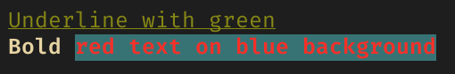

# Crayon

## Install
### Swift Package Manager

Add to `dependencies` in `Package.swift`

```swift
dependencies: [
  .package(url: "https://github.com/k-ymmt/Crayon.git", .upToNextMajor(from: "1.0.0"))
]
```

## Basic Usage
```swift
import Crayon

print("\("Hello", foreground: .blue) \("World", style: .bold)")
```

Output:  


## API
### String Interpolation
Support `String.StringInterpolation`.  
You can set foreground color, background color, and text style.

Example:  
```swift
print("\("Underline with green", style: .underline, foreground: .green)")
print("\("Bold \("red text on blue background", foreground: .red, background: .blue)", style: .bold)")
```

Output:  


### Method chaining
You can also use method chain style.

Example:  
```swift
print(Crayon.blue("Blue text on cyan background").backgroundCyan())
print(Crayon.italic("Italic with magenta text on yellow background").magenta().backgroundYellow())
```

Output:  


### + operator
`Crayon` object is supporting `+` operator.

Example:  
```swift
let text1 = Crayon.blue("Blue text")
let text2 = " and "
let text3 = Crayon.red("Red text")

print(text1 + text2 + text3)
```
Output:  


### Support Level
Xcode's Console does not currently support text colors or styles.  
So if you do print(Crayon.blue("foo") in Xcode's Console, it will be displayed like this.

```
foo
```

If you want to print plane text without the extra characters, do this.

```swift
Crayon.supportLevel = .none
```

`SupportLevel.none` is all colors and styles disabled.

